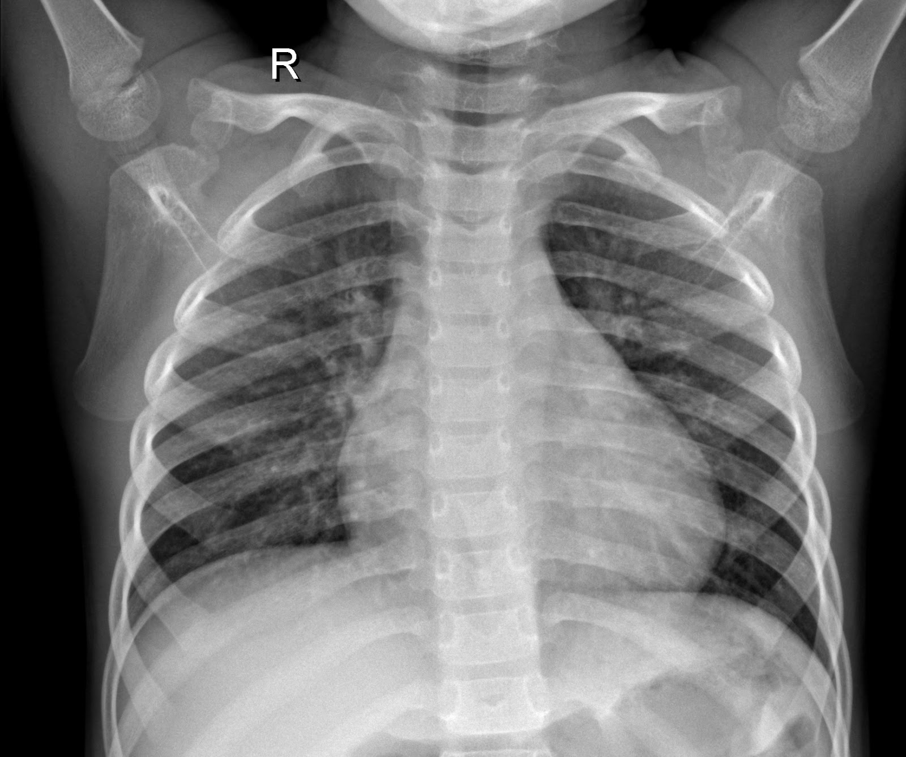

# Chest-X-Ray-Image_Classification

## Itroduction 

In this project we take in a data set with images of chest x-rays with people with and without pneumonia. We performed Image classification using neural networks and convolutional neural networks (CNN). We first built a baseline model with a traditional neural network then improved upon it using a CNN for our final model.  

## Business Case

A hospital reach out to a team of data scientists to create a learning model that would look at chest X-ray to predict whether or not the patient has pneumonia.
Given the dataset from Kaggle, the team are expected to:

- Create an image classification model using Convolutional Neural Network (CNN)

- High accuracy

## Exploratory Data Analysis

